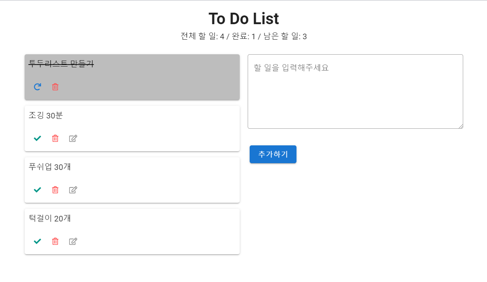
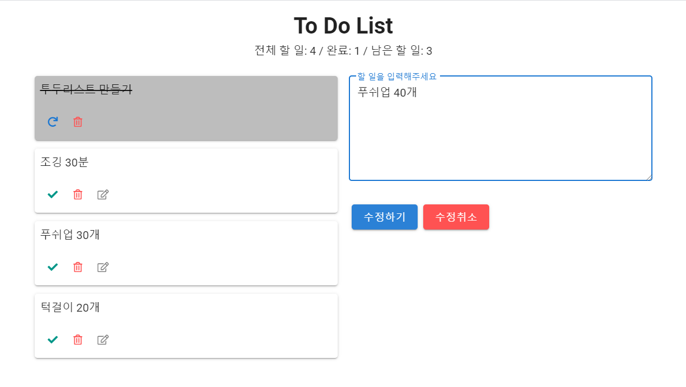

# TodoList

- Vue-cli, vuetify
- Home + List 컴포넌트 + ListAdd 컴포넌트로 구성
- Props, emit을 이용한 todo list 추가, 완료, 삭제
- EventBus를 이용한 todo list 수정







## 시행착오


#### Vetur랑 Vue-cli 쓸 때 주의할 점?

When you create project with Vue CLI,
If no use typescript, please add `jsconfig.json` at opened project root.

```json
{
  "compilerOptions": {
    "target": "es2015",
    "module": "esnext",
    "baseUrl": "./",
    "paths": {
      "@/*": ["components/*"]
    }
  },
  "include": [
    "src/**/*.vue",
    "src/**/*.js"
  ]
}
```

If use typescript, you don't need to do any thing in your project.

[참고]: https://vuejs.github.io/vetur/guide/#vue-cli


이거 때문에 저번에 vuetify가 잘 안됐었나..? => 확인해보기


#### 할 일 status에 따른 v-card background-color

```vue
// 실패
<template>
  <div>
    <v-card
      class="pa-2 ma-1"
      :class="{ 'done': todo.isDone }"
      v-for="(todo, index) in todoList"
      :key="index"
    >
      <p>{{ todo.memo }}</p>
    </v-card>
  </div>
</template>

<script>
export default {
  props: ["todoList"],
};
</script>

<style>
.done {
  background-color: rgb(0, 0, 0)
}
.done p {
  text-decoration: line-through;
}
</style>

```

```vue
// 성공
<template>
  <div>
    <v-card
      class="pa-2 ma-1"
      :class="{ 'grey lighten-1 done': todo.isDone }"
      v-for="(todo, index) in todoList"
      :key="index"
    >
      <p>{{ todo.memo }}</p>
    </v-card>
  </div>
</template>

<script>
export default {
  props: ["todoList"],
};
</script>

<style>
.done p {
  text-decoration: line-through;
}
</style>
```

[참고]: https://vuetifyjs.com/en/styles/colors/

